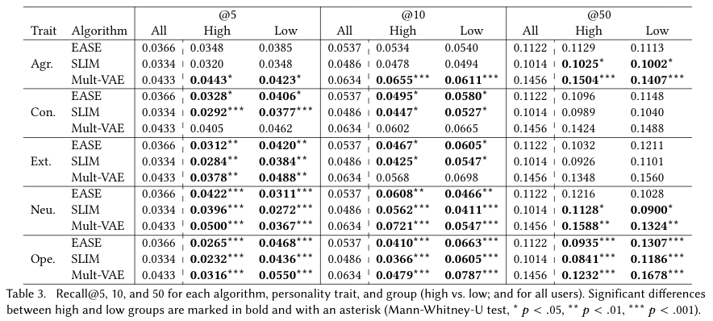

# Personality Bias in Music Recommendation
This repository accompanies the paper "[Personality Bias in Music Recommendation]()" by Alessandro B. Melchiorre, Eva Zangerle, Markus Schedl
published at RecSys 2020.
## Installation

### Environment
To install the environment with conda run

```shell script
conda create  -f pers_bias.yml
```
use the environment with
```shell script
conda activate pers_bias
```
deactivate with
```shell script
conda deactivate
```

### Data
Extract the [data](https://gitlab.cp.jku.at/alessandro/twt-per/-/blob/master/data/RecSys2020_PersonaltiyBiasData.zip) in the /data folder.

You can find description and statistics about the data in the related [notebook](https://gitlab.cp.jku.at/alessandro/twt-per/-/blob/master/data/Stats.ipynb).

## Running
To run the experiments, change the directory according the algorithm to run.
```shell script
cd algorithms/<alg>
python3 main_<alg>_uncontrolled.py
```
e.g.
```shell script
cd algorithms/ease
python3 main_ease_uncontrolled.py
```

There are also 'controlled' experiments in the same folders. In the controlled experiments, the data splitter enforces 
the same number of users for each user group for each trait (**slower**).
You can run these experiments in the same way.

Results will be stored in the **/res** folder according to the algorithm and timestamp.
 

## Results



